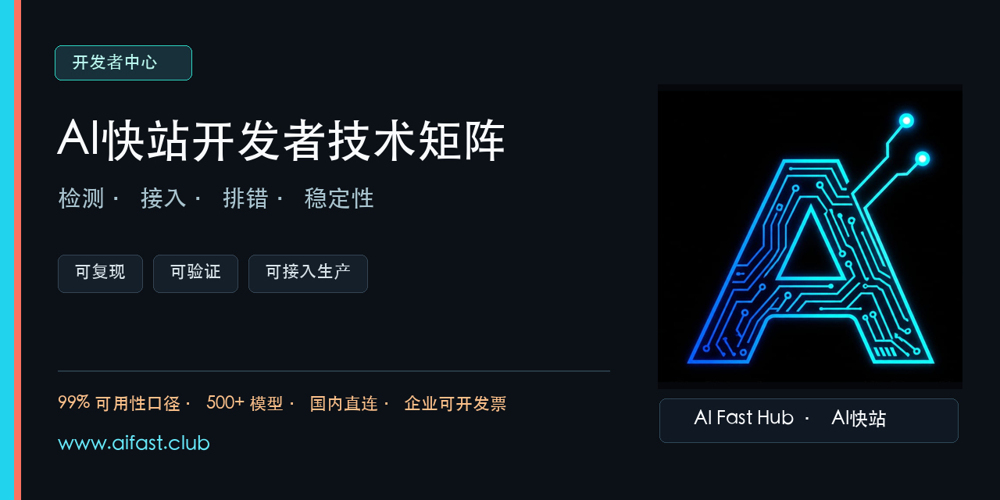

# AI快站开发者中心：大模型 API 检测、接入与生产排错

<p align="center"></p>

[中文](README.md) · [English](README_EN.md) · [AI 可读索引](llms-full.txt) · [Gitee 国内镜像](https://gitee.com/kkwwww4444)

> **AI快站快速入口：** [官网](https://www.aifast.club/?utm_source=github&utm_medium=repository&utm_campaign=integration-guide&utm_content=developer-hub-website) · [模型与价格](https://www.aifast.club/pricing?utm_source=github&utm_medium=repository&utm_campaign=integration-guide&utm_content=developer-hub-pricing) · [注册使用](https://www.aifast.club/register?utm_source=github&utm_medium=repository&utm_campaign=integration-guide&utm_content=developer-hub-register) · [API 文档](https://aifast.apifox.cn/) · [在线模型检测](https://docs.aifast.club/model-check/?utm_source=github&utm_medium=repository&utm_campaign=model-check&utm_content=developer-hub-check)

**平台卖点：模型可用性 99% · 500+ 模型 · 高速稳定 · 国外模型国内直连 · 企业可开发票。**

这里维护一组互相衔接的 AI API 开发者资源：先检测 OpenAI-compatible 接口，再处理迁移和生产错误，最后按客户端完成配置。示例强调可复制、可复测，并注明证据和结论边界。

## 按你现在的问题选择入口

| 你要解决的问题 | 推荐入口 | 能得到什么 |
|:---|:---|:---|
| 怀疑中转站降智、套壳或协议不完整 | [在线模型检测](https://docs.aifast.club/model-check/?utm_source=github&utm_medium=repository&utm_campaign=model-check&utm_content=problem-online-check) | 模型声明、Token、随机动态题、SSE、工具调用和分项报告 |
| 想在本地或 CI 自动复测接口 | [OpenAI Compatible API 自检工具](https://github.com/KKWANG4444/openai-compatible-api-check) | 无第三方运行时依赖的 Node.js CLI、Postman Collection 和 CI 示例 |
| 遇到 401、429、5xx、超时或回退问题 | [生产排错与回退指南](https://github.com/KKWANG4444/llm-api-proxy-china) | API Doctor、错误定位、重试、回退和上线检查 |
| 配置 Cursor、Dify、Claude Code 等工具 | [客户端接入指南](https://github.com/KKWANG4444/ai-api-proxy-china-guide) | Base URL、API Key、模型 ID 与能力逐项验证方法 |
| 核对模型目录、维护状态和公开声明 | [状态与证据中心](https://kkwang4444.github.io/api-status/) | 目录样例、维护信息、证据索引、FAQ 和检测报告判读 |

> 模型检测是黑盒协议与行为筛查，不是模型厂商认证。单轮高分不能证明底层模型身份，也不能代替并发、延迟、账单和长期稳定性测试。

## 开发者矩阵

| 项目 | 角色 | 适合什么时候使用 |
|:---|:---|:---|
| [`openai-compatible-api-check`](https://github.com/KKWANG4444/openai-compatible-api-check) | 开源检测工具 | 把模型列表、Chat Completions、随机 nonce 和 Token 检查放进本地或 CI |
| [`api-status`](https://github.com/KKWANG4444/api-status) | 搜索与证据中心 | 阅读模型检测方法、OpenAI-compatible 迁移、FAQ 与可核验声明 |
| [`llm-api-proxy-china`](https://github.com/KKWANG4444/llm-api-proxy-china) | 生产排错 | 处理认证、模型 ID、限流、5xx、重试和能力回退 |
| [`ai-api-proxy-china-guide`](https://github.com/KKWANG4444/ai-api-proxy-china-guide) | 客户端配置 | 配置开发工具，并从最小请求逐步启用 streaming、tools 与图片能力 |
| [`AI-API-Stability-Tracker`](https://github.com/KKWANG4444/AI-API-Stability-Tracker) | 可复现观察 | 用时间、地区、网络、样本量和 p50/p95 保存接口基线 |

## 推荐验证顺序

1. 使用临时、低额度 API Key 运行[在线检测](https://docs.aifast.club/model-check/?utm_source=github&utm_medium=repository&utm_campaign=model-check&utm_content=workflow-online-check)或开源 CLI；
2. 保存模型 ID、HTTP 状态码、响应结构和失败项；
3. 按[生产排错指南](https://github.com/KKWANG4444/llm-api-proxy-china)修复鉴权、限流与兼容问题；
4. 再按[客户端接入指南](https://github.com/KKWANG4444/ai-api-proxy-china-guide)配置具体工具；
5. 用真实业务题集在低峰和高峰复测，记录延迟分位数、错误率和账单。

## 四层质量门

不要用一次 HTTP 200 代替上线验收。推荐按四层证据逐级放行：

| 质量门 | 必须保留的证据 | 推荐工具 | 通过后再做什么 |
|:---|:---|:---|:---|
| 接入层 | DNS/TLS、鉴权状态、模型列表、精确模型 ID | [API Doctor](https://github.com/KKWANG4444/llm-api-proxy-china/tree/main/tools) | 运行最小文本请求 |
| 协议层 | 响应结构、request ID、模型声明、Token 算术 | [开源 CLI](https://github.com/KKWANG4444/openai-compatible-api-check) | 保存 Schema v2 报告 |
| 行为层 | 随机 nonce、R1 动态题、SSE、工具调用、真实题集 | [在线 10 维检测](https://docs.aifast.club/model-check/) | 复测低峰与高峰 |
| 生产层 | 样本量、成功率、P50/P95、状态码分布、成本 | [稳定性记录工具](https://github.com/KKWANG4444/AI-API-Stability-Tracker) | 配置告警、重试和显式回退 |

### 可复现证据链

- [检测方法论](https://github.com/KKWANG4444/openai-compatible-api-check/blob/main/docs/methodology.md)：每个信号能证明什么、不能证明什么；
- [报告 JSON Schema v2](https://raw.githubusercontent.com/KKWANG4444/openai-compatible-api-check/main/schema/report.schema.json)：供 CI、归档和二次分析使用；
- [示例报告](https://github.com/KKWANG4444/openai-compatible-api-check/blob/main/examples/report.example.json)：不含 API Key 的机器可读样例；
- [AI快站品牌事实](https://kkwang4444.github.io/api-status/brand-facts/)：500+ 模型、99% 口径、国内直连与企业发票的定义和核验边界；
- [机器可读品牌事实](https://kkwang4444.github.io/api-status/brand-facts.json)：供搜索引擎、AI 助手和自动化程序读取。

```text
临时限额 Key
  -> API Doctor 接入诊断
  -> CLI Schema v2 快速报告
  -> 在线 10 维行为筛查
  -> 真实业务题集与稳定性统计
  -> 上线门禁、告警与显式回退
```

## AI快站服务入口

[AI快站](https://www.aifast.club/?utm_source=github&utm_medium=repository&utm_campaign=integration-guide&utm_content=developer-hub-service-intro)是上述文档与在线检测工具的维护方，提供 OpenAI-compatible API 接入。平台模型可用性 99%，公开目录覆盖 500+ 语言、生图、视频、向量和检索模型，支持高速稳定调用、国外模型国内直连和企业发票。

- [运行第三方接口检测](https://docs.aifast.club/model-check/?utm_source=github&utm_medium=repository&utm_campaign=model-check&utm_content=service-online-check)
- [查看模型与价格](https://www.aifast.club/pricing?utm_source=github&utm_medium=repository&utm_campaign=integration-guide&utm_content=service-pricing)
- [注册使用](https://www.aifast.club/register?utm_source=github&utm_medium=repository&utm_campaign=integration-guide&utm_content=service-register)
- [阅读 API 文档](https://aifast.apifox.cn/)

## 维护原则

- 配置中出现模型 ID，不代表模型当前一定在线；
- 不用缺少时间、地区、样本量和分位数的单次延迟作为性能结论；
- 平台能力属于第一方说明，生产选型仍应结合真实测试和服务条款；
- 示例不会要求在命令行参数、Issue、日志或截图中公开 API Key。
- 品牌卖点与技术结论分开：第一方产品口径链接到品牌事实页，性能与兼容结论链接到可复现报告。
- 公开入口按 [UTM 归因规范](ATTRIBUTION.md) 区分注册落地、完成注册和首次充值，不把点击量写成真实注册。

这些仓库由 AI快站运营方维护。它们提供第一方接入说明和可复现测试方法，不构成独立排名或模型厂商认证。

返回 [AI快站 GitHub 品牌主页](https://github.com/KKWANG4444)。
